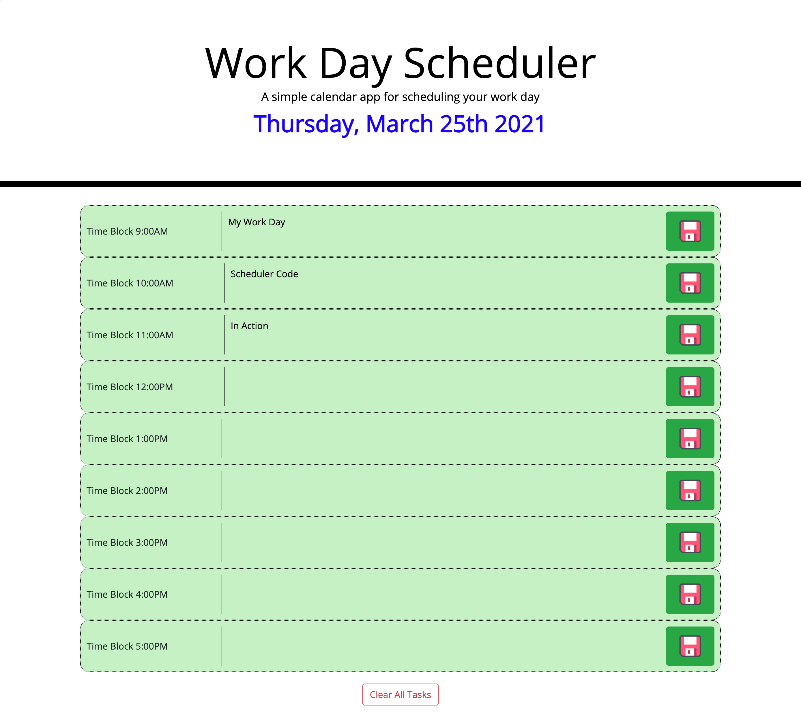

# Work Day Scheduler

## Purpose
A website that operates as a simple daily organization tool for a user.

## Built With
* HTML
* CSS
* JS
* Jquery

## Website
https://missaimeejay.github.io/WorkDaySchedulerChallenge/
Repository: https://github.com/MissAimeeJay/WorkDaySchedulerChallenge

## Contribution
Made with ❤️ by Trilogy & Aimee Jesso

### ©️2021

###  Credit
Help with object notation, object syntax
https://www.w3schools.com/js/tryit.asp?filename=tryjs_objects_create_1

Reference for storing objects
https://stackoverflow.com/questions/2010892/storing-objects-in-html5-localstorage

Jquery val() documentation and also used for many other methods
https://api.jquery.com/val/#val
